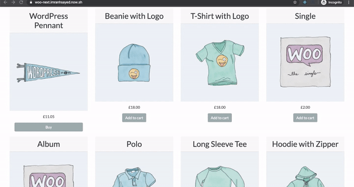
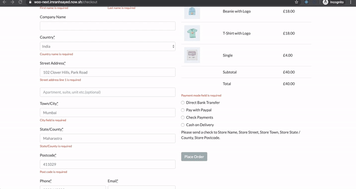

# [WooCommerce Nextjs React Theme](https://woo-next-imranhsayed.vercel.app/) :rocket:

> * This is a React WooCommerce theme, built with Next JS, Webpack, Babel, Node, GraphQl

## Demo Desktop :video_camera:

## Live Demo:

[Live Demo Site](https://woo-next-imranhsayed.vercel.app/)

## Checkout Page Demo

## Payment Demo ( Paypal example )

## Order Received Demo

## Stripe Checkout 
[Stripe Demo Video](https://youtu.be/i75_Vtx-CnA)

# Features:

1. WooCommerce Store in React( contains: Products Page, Single Product Page, AddToCart, CartPage and Checkout Page with country selection ).
2. SSR
3. SEO friendly
4. Automatic Code Splitting
5. Hot Reloading
6. Prefetching
8. Incremental Static (Re)generation ( Next.js 10 support )
9. GraphQL with Apollo Client
10. Tailwindcss
11. Stripe Checkout ( with Stripe Session and Stripe webhook)

## Getting Started :rocket:

These instructions will get you a copy of the project up and running on your local machine for development purposes.

### Prerequisites :page_facing_up:

### Installing :wrench:

1. Clone this repo using terminal `git clone git@github.com:imranhsayed/woo-next`
2. `cd woo-next`
3. `yarn install`

## Add GraphQl support for WordPress

1. Download and activate the following plugins , in your WordPress plugin directory:

* Make sure Woocommerce plugin is also installed in your WordPress site. You can also import default wooCommerce products that come with wooCommerce Plugin for development ( if you don't have any products in your WordPress install ) `WP Dashboard > Tools > Import > WooCommerce products(CSV)`: The WooCommerce default products csv file is available at `wp-content/plugins/woocommerce/sample-data/sample_products.csv`

## Hero Carousel.
To use Hero carousel, create a category called 'offers' from WordPress Dashboard > Products > Categories.
Now create and assign as many child categories to this parent 'offers' category with name, description and image.
These Child categories data will automatically be used to create hero carousel on the frontend.

## Configuration(for GraphQL implementation) :wrench:

1. (Required) Create a `.env` file taking reference from `.env-example` and update your WordPressSite URL.
- `NEXT_PUBLIC_WORDPRESS_URL=https://example.com`

## Common Commands :computer:

* `dev` Runs server in development mode

## Versioning :bookmark_tabs:

I use [Git](https://github.com/) for versioning.

## License :page_with_curl:

This project is licensed under the MIT License - see the [LICENSE.md](LICENSE.md) file for details
